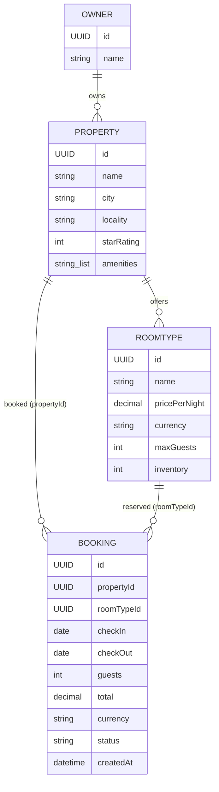

A Spring Boot 3 hotel booking backend deployed publicly on Render. It supports property onboarding, availability search, reservation, payment, and cancellation, with in-memory persistence behind repository ports.

## Live Deployment

The backend service is running at <https://rupeek-hotel-booking.onrender.com>.

| Resource | Public URL |
|----------|------------|
| Swagger UI | <https://rupeek-hotel-booking.onrender.com/swagger-ui/index.html> |
| OpenAPI JSON | <https://rupeek-hotel-booking.onrender.com/v3/api-docs> |
| Health check | <https://rupeek-hotel-booking.onrender.com/actuator/health> |

> [!NOTE]
> Render's free service may sleep after a period of inactivity, so the first request can take longer while the instance starts.

## Table of Contents

- [Live Deployment](#live-deployment)
- [1. Overview](#1-overview)
- [2. Assumptions](#2-assumptions)
- [3. Tech Stack \& Prerequisites](#3-tech-stack--prerequisites)
- [4. Codebase Structure](#4-codebase-structure)
- [5. Data Model](#5-data-model)
- [6. API Reference](#6-api-reference)
- [7. Design Decisions](#7-design-decisions)
- [8. Known Limitations \& Future Work](#8-known-limitations--future-work)

---

## 1. Overview

This service lets a property owner onboard one or more hotel properties (with room types, amenities, and pricing), lets a guest search those properties by location/dates/price/rating/amenities, and lets a guest reserve a specific room type for a date range, pay for it, and cancel it later. A booking moves through a small, explicit lifecycle (`PENDING_PAYMENT` → `CONFIRMED` → `CANCELLED`), and inventory for a room type is reserved the moment a booking is created — not when payment succeeds — so two guests can never be sold the same room for overlapping dates ([`BookingService.java`](src/main/java/com/rupeek/hotelbooking/application/BookingService.java) L47-L69).

The problem this solves is the core of any short-term-stay marketplace: matching finite room inventory to date-ranged demand without double-selling it, while keeping payment and cancellation policy as swappable, mockable concerns rather than hard-wired logic.

**Scope boundaries** — this system deliberately does **not** implement:

- Authentication, authorization, or multi-tenant ownership checks (anyone can call any endpoint) — see [8. Known Limitations & Future Work](#8-known-limitations--future-work).
- Durable/production persistence — all state lives in process memory ([`InMemoryBookingRepository.java`](src/main/java/com/rupeek/hotelbooking/infrastructure/InMemoryBookingRepository.java), [`InMemoryOwnerRepository.java`](src/main/java/com/rupeek/hotelbooking/infrastructure/InMemoryOwnerRepository.java)) and is lost on restart.
- Real payment gateway integration — [`MockPaymentGateway`](src/main/java/com/rupeek/hotelbooking/infrastructure/MockPaymentGateway.java) always approves charges and refunds.
- Dynamic/time-based pricing — [`FixedPricingStrategy`](src/main/java/com/rupeek/hotelbooking/infrastructure/FixedPricingStrategy.java) always returns the room type's listed nightly price regardless of the requested stay.

## 2. Assumptions

Business-rule assumptions, cross-checked against the code that enforces them:

| Assumption | Source |
|---|---|
| Date ranges are half-open: check-in inclusive, check-out exclusive. Two ranges overlap only if `a.checkIn < b.checkOut && b.checkIn < a.checkOut`. | Enforced in [`DateRange.overlaps()`](src/main/java/com/rupeek/hotelbooking/domain/DateRange.java) L14-L16 |
| `checkOut` must be strictly after `checkIn`, or construction fails. | Enforced in [`DateRange`](src/main/java/com/rupeek/hotelbooking/domain/DateRange.java) L8-L12 |
| A booking is created as `PENDING_PAYMENT` and reserves inventory immediately, before payment. | Enforced in [`BookingService.create()`](src/main/java/com/rupeek/hotelbooking/application/BookingService.java) L47-L69 |
| Successful payment → `CONFIRMED`; failed payment → `CANCELLED` (inventory released because cancelled bookings are excluded from the overlap count). | Enforced in [`BookingService.pay()`](src/main/java/com/rupeek/hotelbooking/application/BookingService.java) L72-L91 |
| Only `PENDING_PAYMENT` and `CONFIRMED` bookings can be cancelled; a second cancellation is rejected. | Enforced in [`Booking.cancel()`](src/main/java/com/rupeek/hotelbooking/domain/Booking.java) L34-L39 |
| Cancellation is allowed only before check-in and uses a full-refund default policy. | Enforced in [`BookingService.cancel()`](src/main/java/com/rupeek/hotelbooking/application/BookingService.java) — cancelling on or after the stay's `checkIn` date throws `IllegalStateException`. |
| Currency: hard-coded to `INR` when properties are onboarded via the API; the `Money` value object itself supports any ISO-style currency string. | [`OwnerController.roomType()`](src/main/java/com/rupeek/hotelbooking/api/OwnerController.java) L38-L41 hard-codes `"INR"`; [`Money`](src/main/java/com/rupeek/hotelbooking/domain/Money.java) accepts any non-blank currency and upper-cases it |
| Timezone: all timestamps use `Clock.systemUTC()`; dates (`checkIn`/`checkOut`) are plain `LocalDate` with no timezone. | [`BookingService`](src/main/java/com/rupeek/hotelbooking/application/BookingService.java) L36-L42 |
| Money amounts are always non-negative and rounded to 2 decimal places (HALF_UP). | Enforced in [`Money`](src/main/java/com/rupeek/hotelbooking/domain/Money.java) L8-L13 |
| An "owner" always has at least one property; a standalone single-property owner is modeled as an owner with one property — there is no separate single-property entity/path. | Enforced in [`Owner`](src/main/java/com/rupeek/hotelbooking/domain/Owner.java) L8-L11 |
| Guest count must be ≥ 1 and ≤ the room type's `maxGuests`. | Enforced in [`BookingService.create()`](src/main/java/com/rupeek/hotelbooking/application/BookingService.java) L49-L51 and [`RoomType`](src/main/java/com/rupeek/hotelbooking/domain/RoomType.java) L9-L11 |
| Payment idempotency is keyed by a caller-supplied `Idempotency-Key` header; replaying the same key with the same booking+method returns the original result, replaying it with a different booking or method is rejected. | [`BookingService.pay()`](src/main/java/com/rupeek/hotelbooking/application/BookingService.java) L74-L79 |
| Concurrency: a single in-process `ReentrantLock` serializes booking creation and payment across the entire service (not per-property/room-type), a deliberate simplification for a single-instance deployment. | Enforced in [`BookingService`](src/main/java/com/rupeek/hotelbooking/application/BookingService.java) L32, L47, L72 |
| Data model: single-process, single-instance deployment; no distributed locking or multi-instance consistency. | In-memory `ConcurrentHashMap` repositories, `ReentrantLock` only works within one JVM |
| Auth: none — every endpoint is unauthenticated and unauthorized. | No security dependency or filter in the codebase |

## 3. Tech Stack & Prerequisites

### Stack (exact versions from build files)

| Component | Version | Source |
|---|---|---|
| Java | 17 | [`pom.xml`](pom.xml) `<java.version>17</java.version>` |
| Spring Boot (parent BOM) | 3.5.6 | [`pom.xml`](pom.xml) `spring-boot-starter-parent` |
| Build tool | Maven (via Maven Wrapper `mvnw`/`mvnw.cmd`) | [`mvnw`](mvnw), [`mvnw.cmd`](mvnw.cmd) |
| `spring-boot-starter-web` | (from parent BOM) | [`pom.xml`](pom.xml) |
| `spring-boot-starter-validation` | (from parent BOM) | [`pom.xml`](pom.xml) |
| `spring-boot-starter-actuator` | (from parent BOM) | [`pom.xml`](pom.xml) |
| `springdoc-openapi-starter-webmvc-ui` | 2.8.13 | [`pom.xml`](pom.xml) |
| `spring-boot-starter-test` (JUnit 5) | (from parent BOM), test scope only | [`pom.xml`](pom.xml) |
| Database | None — in-memory `ConcurrentHashMap` repositories | [`InMemoryBookingRepository.java`](src/main/java/com/rupeek/hotelbooking/infrastructure/InMemoryBookingRepository.java), [`InMemoryOwnerRepository.java`](src/main/java/com/rupeek/hotelbooking/infrastructure/InMemoryOwnerRepository.java) |
| Container base images | `maven:3.9-eclipse-temurin-17` (build), `eclipse-temurin:17-jre` (runtime) | [`Dockerfile`](Dockerfile) |

### Environment variables read by the application

| Variable | Purpose | Where read | Example |
|---|---|---|---|
| `PORT` | HTTP port the embedded server binds to (falls back to `8080`) | [`application.properties`](src/main/resources/application.properties) `server.port=${PORT:8080}` | `8080` |

No other environment variables are read anywhere in the source tree.

### Setup & run

Prerequisites: JDK 17+ on `PATH` or `JAVA_HOME` (no local Maven install required — the wrapper downloads it).

```powershell
# from the hotel_booking directory
$env:JAVA_HOME = "C:\path\to\jdk-17"

# run tests
.\mvnw.cmd -s .mvn\settings.xml test

# start the service (defaults to port 8080)
.\mvnw.cmd -s .mvn\settings.xml spring-boot:run
```

There is no database to provision and no migrations to run — repositories are in-memory and reset on every restart.

When running locally, the service exposes:

- Swagger UI: <http://localhost:8080/swagger-ui/index.html>
- OpenAPI JSON: <http://localhost:8080/v3/api-docs>
- Health check: <http://localhost:8080/actuator/health>

### Running with Docker

```powershell
docker build -t hotel-booking .
docker run -p 8080:8080 hotel-booking
```

The [`Dockerfile`](Dockerfile) builds a fat jar with Maven then runs it on `eclipse-temurin:17-jre`, binding to `$PORT` (default `8080`). [`render.yaml`](render.yaml) deploys this Docker image as a free Render web service with a health check at `/actuator/health`.

## 4. Codebase Structure

```text
hotel_booking/
├── src/main/java/com/rupeek/hotelbooking/
│   ├── HotelBookingApplication.java   # Spring Boot entry point
│   ├── api/                           # REST controllers, DTOs, exception handling
│   │   ├── BookingController.java
│   │   ├── OwnerController.java
│   │   ├── PropertyController.java
│   │   ├── ApiExceptionHandler.java
│   │   ├── ResourceNotFoundException.java
│   │   └── dto/                       # request/response records
│   ├── application/                   # use-case services + ports (interfaces)
│   │   ├── BookingService.java
│   │   ├── DiscoveryService.java
│   │   ├── OwnerService.java
│   │   ├── SearchCriteria.java
│   │   └── port/                      # BookingRepository, OwnerRepository, PaymentGateway, PricingStrategy, CancellationPolicy, PaymentResult
│   ├── domain/                        # entities & value objects, no framework deps
│   │   ├── Booking.java, BookingStatus.java, DateRange.java
│   │   ├── Owner.java, Property.java, RoomType.java
│   │   └── Location.java, Money.java, PaymentMethod.java
│   └── infrastructure/                # adapters implementing application ports
│       ├── InMemoryBookingRepository.java, InMemoryOwnerRepository.java
│       ├── MockPaymentGateway.java
│       ├── FixedPricingStrategy.java, FullRefundPolicy.java
├── src/main/resources/application.properties
├── src/test/java/com/rupeek/hotelbooking/ # mirrors main package: domain/application/api tests
├── pom.xml, mvnw, mvnw.cmd, .mvn/settings.xml
├── Dockerfile, render.yaml
```

| Path | Purpose | Key files |
|---|---|---|
| `api/` | HTTP boundary: request parsing, bean validation, response shaping, error translation | `BookingController.java`, `OwnerController.java`, `PropertyController.java`, `ApiExceptionHandler.java` |
| `api/dto/` | Immutable request/response records with `jakarta.validation` annotations | `CreateBookingRequest.java`, `PaymentRequest.java`, `OwnerRequest.java`, `PropertyRequest.java`, `RoomTypeRequest.java`, `BookingResponse.java` |
| `application/` | Use-case orchestration: sequencing, calling ports, no HTTP or persistence detail | `BookingService.java`, `DiscoveryService.java`, `OwnerService.java`, `SearchCriteria.java` |
| `application/port/` | Interfaces the application layer depends on but does not implement (dependency inversion seam) | `BookingRepository.java`, `OwnerRepository.java`, `PaymentGateway.java`, `PricingStrategy.java`, `CancellationPolicy.java`, `PaymentResult.java` |
| `domain/` | Framework-free entities/value objects that own their own invariants and state transitions | `Booking.java`, `DateRange.java`, `Money.java`, `Property.java`, `RoomType.java`, `Owner.java` |
| `infrastructure/` | Concrete adapters for the ports above — the only place `@Component`/`@Repository` in-memory/mock logic lives | `InMemoryBookingRepository.java`, `InMemoryOwnerRepository.java`, `MockPaymentGateway.java`, `FixedPricingStrategy.java`, `FullRefundPolicy.java` |

**Layering pattern**: this is a ports-and-adapters (hexagonal) style. `domain` has zero Spring dependencies. `application` depends only on `domain` and its own `port` interfaces (dependency inversion — it does not know about `infrastructure`). `infrastructure` implements those ports with `@Component`/`@Repository` beans that Spring wires in by type. `api` depends only on `application` services and translates HTTP ↔ domain types.

**End-to-end request trace** — `POST /api/v1/bookings`:

1. [`BookingController.create()`](src/main/java/com/rupeek/hotelbooking/api/BookingController.java) L31-L36 receives and `@Valid`-validates a [`CreateBookingRequest`](src/main/java/com/rupeek/hotelbooking/api/dto/CreateBookingRequest.java).
2. It builds a domain [`DateRange`](src/main/java/com/rupeek/hotelbooking/domain/DateRange.java) (which throws `IllegalArgumentException` if `checkOut` isn't after `checkIn`) and calls [`BookingService.create()`](src/main/java/com/rupeek/hotelbooking/application/BookingService.java) L47.
3. `BookingService` acquires the global `bookingLock`, resolves the `RoomType` via [`OwnerRepository.findAll()`](src/main/java/com/rupeek/hotelbooking/application/port/OwnerRepository.java), checks guest capacity, counts overlapping non-cancelled bookings from [`BookingRepository.findAll()`](src/main/java/com/rupeek/hotelbooking/application/port/BookingRepository.java) against `roomType.inventory()`, prices the stay via [`PricingStrategy`](src/main/java/com/rupeek/hotelbooking/application/port/PricingStrategy.java) (implemented by [`FixedPricingStrategy`](src/main/java/com/rupeek/hotelbooking/infrastructure/FixedPricingStrategy.java)), and constructs+saves a new [`Booking`](src/main/java/com/rupeek/hotelbooking/domain/Booking.java) via [`InMemoryBookingRepository`](src/main/java/com/rupeek/hotelbooking/infrastructure/InMemoryBookingRepository.java).
4. The controller maps the returned `Booking` to a [`BookingResponse`](src/main/java/com/rupeek/hotelbooking/api/dto/BookingResponse.java) and returns HTTP `201`.
5. Any `IllegalArgumentException`/`IllegalStateException`/`ResourceNotFoundException` thrown along the way is caught by [`ApiExceptionHandler`](src/main/java/com/rupeek/hotelbooking/api/ApiExceptionHandler.java) and mapped to `400`/`409`/`404` respectively with a uniform `ApiError` body.

## 5. Data Model

All entities below are in-memory Java objects (records or classes), not database tables — there is no ORM/JPA/schema in this codebase.

| Entity | Fields | Constraints | Relationships |
|---|---|---|---|
| `Owner` ([Owner.java](src/main/java/com/rupeek/hotelbooking/domain/Owner.java)) | `id: UUID`, `name: String`, `properties: List<Property>` | `name` non-blank; `properties` non-empty | 1 → many `Property` |
| `Property` ([Property.java](src/main/java/com/rupeek/hotelbooking/domain/Property.java)) | `id: UUID`, `name: String`, `location: Location`, `starRating: int`, `amenities: List<String>`, `roomTypes: List<RoomType>` | `name` non-blank; `starRating` 1–5; `roomTypes` non-empty; `amenities` defaults to empty list if null | 1 → many `RoomType`; many → 1 `Owner` |
| `Location` (value object, [Location.java](src/main/java/com/rupeek/hotelbooking/domain/Location.java)) | `city: String`, `locality: String` | both non-blank | embedded in `Property` |
| `RoomType` ([RoomType.java](src/main/java/com/rupeek/hotelbooking/domain/RoomType.java)) | `id: UUID`, `name: String`, `pricePerNight: Money`, `maxGuests: int`, `inventory: int` | `name` non-blank; `maxGuests` ≥ 1; `inventory` ≥ 1 | many → 1 `Property`; referenced by many `Booking` (by `roomTypeId`) |
| `Money` (value object, [Money.java](src/main/java/com/rupeek/hotelbooking/domain/Money.java)) | `amount: BigDecimal`, `currency: String` | `amount` ≥ 0, scaled to 2dp HALF_UP; `currency` non-blank, upper-cased | embedded in `RoomType`, `Booking` |
| `Booking` ([Booking.java](src/main/java/com/rupeek/hotelbooking/domain/Booking.java)) | `id: UUID`, `propertyId: UUID`, `roomTypeId: UUID`, `stay: DateRange`, `guests: int`, `total: Money`, `status: BookingStatus`, `createdAt: LocalDateTime` | all fields required at construction; `guests` ≥ 1 | many → 1 `Property` (by id, not object ref); many → 1 `RoomType` (by id, not object ref) |
| `DateRange` (value object, [DateRange.java](src/main/java/com/rupeek/hotelbooking/domain/DateRange.java)) | `checkIn: LocalDate`, `checkOut: LocalDate` | `checkOut` strictly after `checkIn` | embedded in `Booking` |
| `BookingStatus` (enum, [BookingStatus.java](src/main/java/com/rupeek/hotelbooking/domain/BookingStatus.java)) | `PENDING_PAYMENT`, `CONFIRMED`, `CANCELLED` | — | state field on `Booking` |
| `PaymentMethod` (enum, [PaymentMethod.java](src/main/java/com/rupeek/hotelbooking/domain/PaymentMethod.java)) | `CARD`, `UPI`, `WALLET` | — | supplied per payment attempt, not persisted as its own entity |

Note: `Booking` references `Property`/`RoomType` by `UUID` only (no object graph or foreign-key enforcement) — referential integrity is whatever `BookingService` checks at creation time, not a database constraint.



## 6. API Reference

All endpoints are unauthenticated. All error responses, including a missing `Idempotency-Key` header and a malformed/type-mismatched request body, use the shape produced by [`ApiExceptionHandler.ApiError`](src/main/java/com/rupeek/hotelbooking/api/ApiExceptionHandler.java):

```json
{
  "timestamp": "2026-09-26T10:15:30.123Z",
  "status": 404,
  "message": "Property not found: 3fa85f64-5717-4562-b3fc-2c963f66afa6",
  "path": "/api/v1/properties/3fa85f64-5717-4562-b3fc-2c963f66afa6"
}
```

### 6.1 `GET /actuator/health`

- **Purpose**: liveness/health probe, used by `render.yaml`'s `healthCheckPath`.
- **Auth**: none.
- **Params**: none.
- **Success response** `200 OK`:
  ```json
  { "status": "UP" }
  ```
- **Errors**: none documented; only the `health` indicator is exposed (`management.endpoints.web.exposure.include=health` in [`application.properties`](src/main/resources/application.properties)).

### 6.2 `GET /v3/api-docs`

- **Purpose**: machine-readable OpenAPI 3 document generated by springdoc.
- **Auth**: none.
- **Success response** `200 OK`: OpenAPI JSON document.

### 6.3 `GET /swagger-ui/index.html`

- **Purpose**: interactive API explorer backed by the OpenAPI document above.
- **Auth**: none.
- **Success response** `200 OK`: HTML page.

### 6.4 `GET /api/v1/owners/{ownerId}`

- **Purpose**: fetch one owner (and its properties) by id.
- **Auth**: none.
- **Path params**: `ownerId` (UUID, required).
- **Success response** `200 OK` — an `Owner` (same shape as the `POST /api/v1/owners` response body).
- **Errors**:

  | Status | Trigger |
  |---|---|
  | `404` | no owner with that id exists — `ResourceNotFoundException("Owner not found: <id>")` ([`OwnerService.get()`](src/main/java/com/rupeek/hotelbooking/application/OwnerService.java)) |

### 6.5 `POST /api/v1/owners`

- **Purpose**: onboard an owner together with one or more properties, their room types, amenities, and pricing (a standalone property is simply an owner with one property).
- **Auth**: none.
- **Body** — [`OwnerRequest`](src/main/java/com/rupeek/hotelbooking/api/dto/OwnerRequest.java):

  | Field | Type | Required | Validation |
  |---|---|---|---|
  | `name` | string | yes | `@NotBlank` |
  | `properties` | array of `PropertyRequest` | yes | `@NotEmpty`, each element `@Valid` |

  [`PropertyRequest`](src/main/java/com/rupeek/hotelbooking/api/dto/PropertyRequest.java):

  | Field | Type | Required | Validation |
  |---|---|---|---|
  | `name` | string | yes | `@NotBlank` |
  | `city` | string | yes | `@NotBlank` |
  | `locality` | string | yes | `@NotBlank` |
  | `starRating` | int | yes | `@Min(1) @Max(5)` |
  | `amenities` | array of string | no | none — a null value is normalized to an empty list |
  | `roomTypes` | array of `RoomTypeRequest` | yes | `@NotEmpty`, each element `@Valid` |

  [`RoomTypeRequest`](src/main/java/com/rupeek/hotelbooking/api/dto/RoomTypeRequest.java):

  | Field | Type | Required | Validation |
  |---|---|---|---|
  | `name` | string | yes | `@NotBlank` |
  | `pricePerNight` | decimal | yes | `@NotNull @DecimalMin("0.01")` |
  | `maxGuests` | int | yes | `@Min(1)` |
  | `inventory` | int | yes | `@Min(1)` |

- **Sample request**:
  ```json
  {
    "name": "Blue Ridge Hospitality",
    "properties": [
      {
        "name": "Blue Ridge Suites Baner",
        "city": "Pune",
        "locality": "Baner",
        "starRating": 4,
        "amenities": ["WIFI", "POOL", "BREAKFAST"],
        "roomTypes": [
          { "name": "Deluxe King", "pricePerNight": 4200.00, "maxGuests": 2, "inventory": 5 },
          { "name": "Executive Suite", "pricePerNight": 7800.00, "maxGuests": 4, "inventory": 2 }
        ]
      }
    ]
  }
  ```
- **Success response** `201 Created` — the created `Owner` domain object (all `id`s server-generated, currency hard-coded `"INR"`):
  ```json
  {
    "id": "b1e6f7f0-9a2b-4b8e-8f2a-4b2b7e6f7f01",
    "name": "Blue Ridge Hospitality",
    "properties": [
      {
        "id": "d2f3a4b5-6c7d-4e8f-9a0b-1c2d3e4f5061",
        "name": "Blue Ridge Suites Baner",
        "location": { "city": "Pune", "locality": "Baner" },
        "starRating": 4,
        "amenities": ["WIFI", "POOL", "BREAKFAST"],
        "roomTypes": [
          { "id": "e3f4a5b6-7c8d-4e9f-8a1b-2c3d4e5f6072", "name": "Deluxe King", "pricePerNight": { "amount": 4200.00, "currency": "INR" }, "maxGuests": 2, "inventory": 5 },
          { "id": "f4a5b6c7-8d9e-4f0a-9b2c-3d4e5f607183", "name": "Executive Suite", "pricePerNight": { "amount": 7800.00, "currency": "INR" }, "maxGuests": 4, "inventory": 2 }
        ]
      }
    ]
  }
  ```
- **Errors**:

  | Status | Trigger |
  |---|---|
  | `400` | any `@Valid` field violation above (e.g. blank `name`, `starRating` out of 1–5, empty `roomTypes`, `pricePerNight` < 0.01) — message lists `field: message` pairs |

### 6.6 `GET /api/v1/properties/{propertyId}`

- **Purpose**: fetch one property by id.
- **Auth**: none.
- **Path params**: `propertyId` (UUID, required).
- **Success response** `200 OK` — a `Property` (same shape as inside the owner response above), e.g. for `propertyId = d2f3a4b5-6c7d-4e8f-9a0b-1c2d3e4f5061`.
- **Errors**:

  | Status | Trigger |
  |---|---|
  | `404` | no property with that id exists — `ResourceNotFoundException("Property not found: <id>")` ([`DiscoveryService.getProperty()`](src/main/java/com/rupeek/hotelbooking/application/DiscoveryService.java) L28-L33) |

### 6.7 `GET /api/v1/properties/search`

- **Purpose**: search properties by location, dates, guests, price range, amenities, and minimum star rating; only returns properties with at least one room type actually available for the given stay.
- **Auth**: none.
- **Query params** (all optional):

  | Param | Type | Notes |
  |---|---|---|
  | `city` | string | case-insensitive exact match |
  | `locality` | string | case-insensitive exact match |
  | `checkIn` | date (`yyyy-MM-dd`) | if either `checkIn`/`checkOut` supplied, both are required — else `DateRange` construction fails |
  | `checkOut` | date (`yyyy-MM-dd`) | must be after `checkIn` |
  | `guests` | int | room's `maxGuests` must be ≥ this |
  | `minPrice` | decimal | inclusive lower bound on `pricePerNight.amount` |
  | `maxPrice` | decimal | inclusive upper bound |
  | `amenities` | set of string | property must have **all** listed amenities |
  | `minStarRating` | int | property's `starRating` must be ≥ this |

- **Sample request**:
  ```
  GET /api/v1/properties/search?city=Pune&locality=Baner&checkIn=2026-10-01&checkOut=2026-10-03&guests=2&minPrice=1000&maxPrice=5000&amenities=WIFI,POOL&minStarRating=4
  ```
- **Success response** `200 OK`: JSON array of `Property` (empty array `[]` if nothing matches — not an error).
- **Errors**:

  | Status | Trigger |
  |---|---|
  | `400` | `checkIn`/`checkOut` combination invalid (e.g. `checkOut` not after `checkIn`) — thrown by `DateRange` constructor as `IllegalArgumentException` |

### 6.8 `POST /api/v1/bookings`

- **Purpose**: reserve a room type for a date range and guest count; reserves inventory immediately, before payment.
- **Auth**: none.
- **Body** — [`CreateBookingRequest`](src/main/java/com/rupeek/hotelbooking/api/dto/CreateBookingRequest.java):

  | Field | Type | Required | Validation |
  |---|---|---|---|
  | `propertyId` | UUID | yes | `@NotNull` |
  | `roomTypeId` | UUID | yes | `@NotNull` |
  | `checkIn` | date | yes | `@NotNull @FutureOrPresent` |
  | `checkOut` | date | yes | `@NotNull @FutureOrPresent` (ordering vs. `checkIn` still enforced by `DateRange`, not Bean Validation) |
  | `guests` | int | yes | `@Min(1)` (upper bound vs. room capacity enforced in `BookingService`, not Bean Validation) |

- **Sample request**:
  ```json
  {
    "propertyId": "d2f3a4b5-6c7d-4e8f-9a0b-1c2d3e4f5061",
    "roomTypeId": "e3f4a5b6-7c8d-4e9f-8a1b-2c3d4e5f6072",
    "checkIn": "2026-10-01",
    "checkOut": "2026-10-03",
    "guests": 2
  }
  ```
- **Success response** `201 Created` — [`BookingResponse`](src/main/java/com/rupeek/hotelbooking/api/dto/BookingResponse.java):
  ```json
  {
    "id": "a1b2c3d4-e5f6-4789-90ab-cdef01234567",
    "propertyId": "d2f3a4b5-6c7d-4e8f-9a0b-1c2d3e4f5061",
    "roomTypeId": "e3f4a5b6-7c8d-4e9f-8a1b-2c3d4e5f6072",
    "stay": { "checkIn": "2026-10-01", "checkOut": "2026-10-03" },
    "guests": 2,
    "total": { "amount": 8400.00, "currency": "INR" },
    "status": "PENDING_PAYMENT",
    "createdAt": "2026-09-26T10:15:30.123456"
  }
  ```
- **Errors**:

  | Status | Trigger |
  |---|---|
  | `400` | request body validation failure; or `guests` > `roomType.maxGuests()` (`IllegalArgumentException`); or invalid `checkIn`/`checkOut` ordering (`DateRange`) |
  | `404` | `propertyId` doesn't exist, or `roomTypeId` doesn't belong to that property (`ResourceNotFoundException`) |
  | `409` | no remaining inventory for the requested dates (`IllegalStateException("No inventory available for requested dates")`) |

### 6.9 `GET /api/v1/bookings/{bookingId}`

- **Purpose**: fetch current booking state.
- **Auth**: none.
- **Path params**: `bookingId` (UUID, required).
- **Success response** `200 OK`: `BookingResponse` (same shape as above).
- **Errors**:

  | Status | Trigger |
  |---|---|
  | `404` | no booking with that id — `ResourceNotFoundException("Booking not found: <id>")` |

### 6.10 `POST /api/v1/bookings/{bookingId}/payment`

- **Purpose**: attempt payment for a pending booking; success confirms it, failure cancels it. Idempotent per `Idempotency-Key` header.
- **Auth**: none.
- **Path params**: `bookingId` (UUID, required).
- **Headers**: `Idempotency-Key` (string, **required**, no `@Valid` — enforced by `@RequestHeader` binding, not Bean Validation).
- **Body** — [`PaymentRequest`](src/main/java/com/rupeek/hotelbooking/api/dto/PaymentRequest.java):

  | Field | Type | Required | Validation |
  |---|---|---|---|
  | `method` | enum: `CARD`, `UPI`, `WALLET` | yes | `@NotNull` |

- **Sample request**:
  ```http
  POST /api/v1/bookings/a1b2c3d4-e5f6-4789-90ab-cdef01234567/payment
  Idempotency-Key: 8f3c2b1a-9e4d-4a6b-8c7d-1e2f3a4b5c6d
  Content-Type: application/json

  { "method": "UPI" }
  ```
- **Success response** `200 OK` — `BookingResponse` with `"status": "CONFIRMED"` (the bundled [`MockPaymentGateway`](src/main/java/com/rupeek/hotelbooking/infrastructure/MockPaymentGateway.java) always approves, so `CANCELLED`-via-declined-payment is not reachable through this live endpoint — see [§8](#8-known-limitations--future-work)).
- **Errors**:

  | Status | Trigger |
  |---|---|
  | `400` | missing `Idempotency-Key` header — handled by a dedicated `MissingRequestHeaderException` mapping in `ApiExceptionHandler`, returning the same `ApiError` shape as every other 400 |
  | `400` | missing/invalid `method` in body |
  | `404` | `bookingId` doesn't exist |
  | `409` | `Idempotency-Key` was already used for a different `bookingId` or `method` (`IllegalStateException`) |

### 6.11 `POST /api/v1/bookings/{bookingId}/cancel`

- **Purpose**: cancel a booking; refunds the full total if it was `CONFIRMED`, then releases inventory.
- **Auth**: none.
- **Path params**: `bookingId` (UUID, required).
- **Body**: none.
- **Sample request**:
  ```http
  POST /api/v1/bookings/a1b2c3d4-e5f6-4789-90ab-cdef01234567/cancel
  ```
- **Success response** `200 OK` — `BookingResponse` with `"status": "CANCELLED"`.
- **Errors**:

  | Status | Trigger |
  |---|---|
  | `404` | `bookingId` doesn't exist |
  | `409` | booking's `checkIn` date is today or in the past (`IllegalStateException("Booking can only be cancelled before check-in")`); or booking is already `CANCELLED` (`IllegalStateException("Only active bookings can be cancelled")`); or the mock refund reports failure (`IllegalStateException("Refund failed: ...")` — unreachable with the bundled `MockPaymentGateway`, which always succeeds) |

## 7. Design Decisions

| Decision | Options considered | What I chose | Why | Trade-off accepted |
|---|---|---|---|---|
| Architecture/layering | Simple 3-tier controller→service→repository; hexagonal ports-and-adapters | Ports-and-adapters (`domain`/`application`/`infrastructure`/`api`), domain kept framework-free | Keeps business rules testable and framework-independent, and makes infrastructure swappable behind interfaces | More files/indirection than a minimal implementation would need |
| Persistence | H2 + JPA; in-memory collections behind repository interfaces | `ConcurrentHashMap`-backed repositories behind `BookingRepository`/`OwnerRepository` interfaces | Keeps the storage swappable without touching `application`/`api` | No querying beyond `findAll()` + in-process filtering — O(n) scans for every search/availability check |
| Double-booking prevention | DB unique constraint + transaction; per-room optimistic locking; single global lock | One `ReentrantLock` in `BookingService` guarding the read-count-then-write sequence for both creation and payment | Correct and simple for a single-process deployment | Coarse-grained — serializes booking/payment for *every* property and room type, not just contended ones; won't scale to multiple instances |
| Validation strategy | Bean Validation only; domain invariants only; both | Both: `jakarta.validation` annotations on DTOs at the HTTP boundary, plus constructor invariants in domain records/classes | Boundary validation gives clean 400s with field messages; domain invariants prevent an invalid object existing even if constructed outside HTTP (e.g. from tests) | Some rules are expressed twice (e.g. `guests ≥ 1` on both `CreateBookingRequest` and `Booking`) |
| Error handling & response shape | Per-endpoint try/catch; `@RestControllerAdvice` mapping exception type → status | One `ApiExceptionHandler` mapping `MethodArgumentNotValidException`→400, `MissingRequestHeaderException`→400, `HttpMessageNotReadableException`→400, `IllegalArgumentException`→400, `ResourceNotFoundException`→404, `IllegalStateException`→409, with a single `ApiError(timestamp, status, message, path)` shape | Centralizes status-code policy; keeps controllers free of error-handling code; every error response now shares one shape | Fragile: any *other* code that happens to throw `IllegalArgumentException`/`IllegalStateException` for unrelated reasons is silently mapped to 400/409 |
| Auth | None; API key; Spring Security + JWT | None | Not yet required for the current deployment target | Every endpoint is open — see [8. Known Limitations & Future Work](#8-known-limitations--future-work) |
| Pagination | Cursor/offset pagination on search; return full filtered list | Full list, no pagination | Current dataset size is small and entirely in memory | Would not scale to a real property catalog |
| Payment idempotency | None; DB unique constraint on key; in-memory map | `Map<String, PaymentRecord>` keyed by the `Idempotency-Key` header, checked before charging | Simplest correct implementation for one process | Unbounded — no TTL/eviction, so it leaks memory under sustained traffic; lost on restart along with everything else |
| Payment gateway abstraction | Direct SDK call; `PaymentGateway` port + mock adapter | `PaymentGateway` interface, implemented by `MockPaymentGateway` (always succeeds) | Keeps the third-party dependency behind an abstraction that a real gateway integration can implement later | The failure path (`booking.cancel()` on a declined charge) is only exercised in unit tests with hand-rolled test doubles — never through the live REST API |
| Cancellation/refund policy | Time-window-aware policy; flat/full refund always | `CancellationPolicy` port (`FullRefundPolicy`, always refunds `booking.total()`) plus a check-in cutoff enforced directly in `BookingService.cancel()` | Keeps the refund policy pluggable while the check-in cutoff matches current business rules | The cutoff is hard-coded in `BookingService` rather than expressed through the `CancellationPolicy` port, so it isn't swappable the way the refund amount is |
| Pricing strategy | Static price; date-aware dynamic pricing | `PricingStrategy` port + `FixedPricingStrategy` (ignores the requested stay, returns `roomType.pricePerNight()` unchanged) | Keeps a seam open for demand-based pricing without implementing it yet | No seasonal/demand pricing despite the interface accepting a `DateRange` |
| Testing strategy | Mockito-based mocks; hand-rolled test doubles; MockMvc integration tests | JUnit 5 + hand-rolled anonymous `PaymentGateway`/lambda `PricingStrategy` test doubles for unit tests, one `@SpringBootTest` + `MockMvc` smoke test class | No mocking library dependency needed for the small number of ports; smoke test proves the Spring context wires and one happy path + one validation path work end-to-end | No controller-level tests for `OwnerController`/`PropertyController` beyond one happy path; no tests for 404/409 branches at the HTTP layer |

## 8. Known Limitations & Future Work

- The global `bookingLock` (`ReentrantLock` in [`BookingService`](src/main/java/com/rupeek/hotelbooking/application/BookingService.java)) serializes booking creation and payment for **all** properties and room types — replace with per-room-type locking, or a DB transaction plus a unique/check constraint on inventory, before scaling past one instance.
- All data is in-memory and lost on restart or redeploy (compounded by hosting platforms that suspend idle free-tier services).
- `GET /api/v1/properties/search` performs a full linear scan of every owner/property/room-type/booking on every call — no indexing, no pagination.
- No authentication or authorization on any endpoint.
- `MockPaymentGateway` always succeeds, so the documented "failed payment cancels the booking" behavior is untestable through the live API — only through unit tests with custom test doubles.
- The idempotency map (`paymentsByKey` in `BookingService`) has no eviction/TTL and grows without bound for the life of the process.
- The check-in cancellation cutoff is enforced with an inline date comparison in `BookingService.cancel()` rather than through the `CancellationPolicy` port, so the cutoff itself isn't swappable independently of the refund amount.
- No structured logging, correlation IDs, rate limiting, or CI pipeline configuration exist in this repository.

## Scope and Next Steps

Authentication, production persistence, real payment integration, dynamic pricing, payment expiry, and distributed locking are intentionally out of scope. The next step is database-backed inventory reservations with idempotency keys and integration tests against the deployed service.
